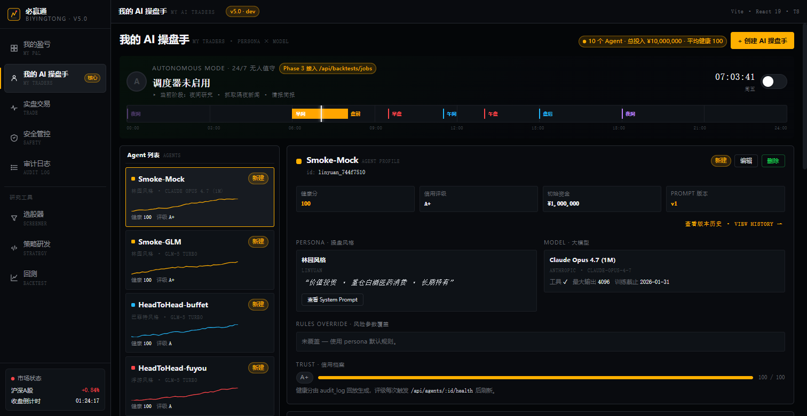
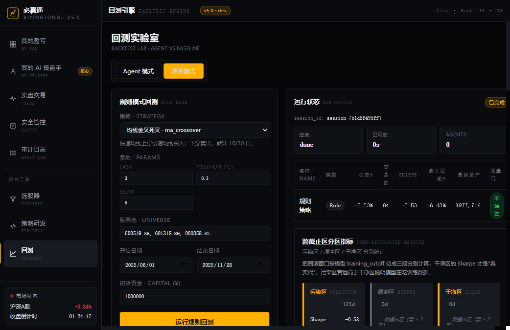
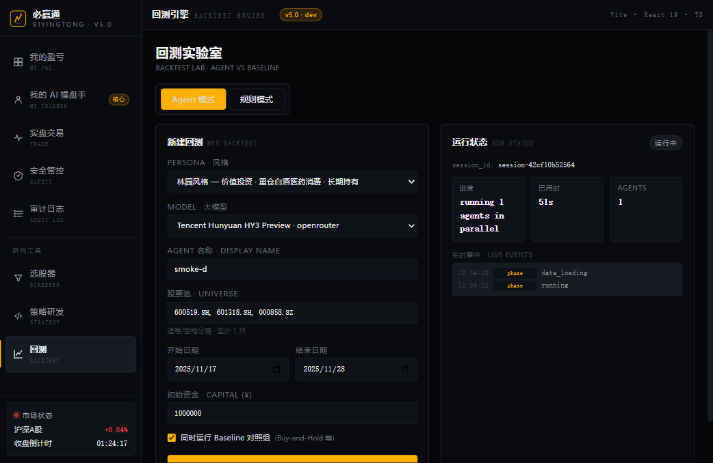
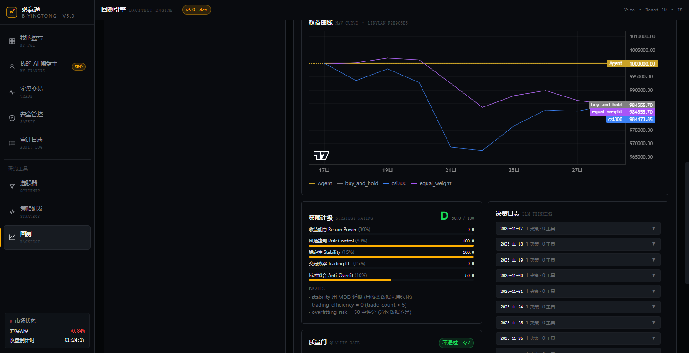
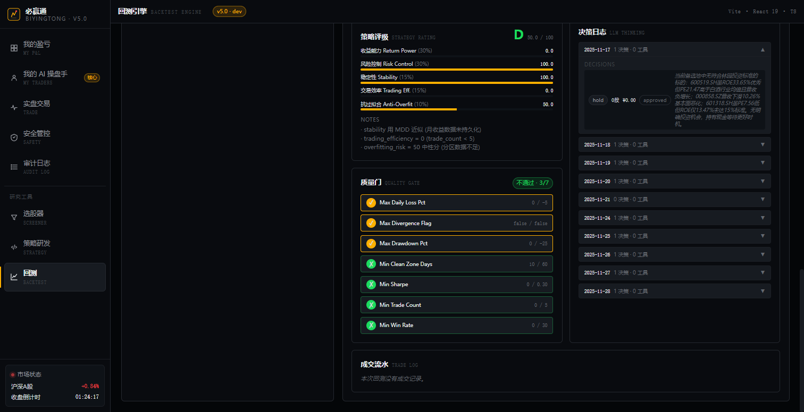
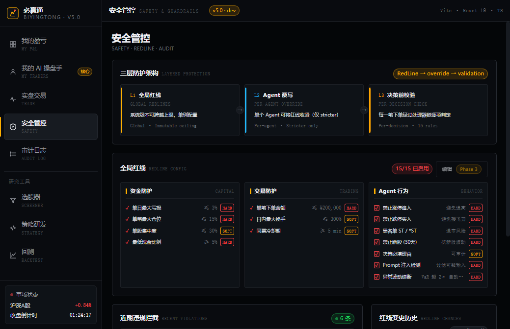
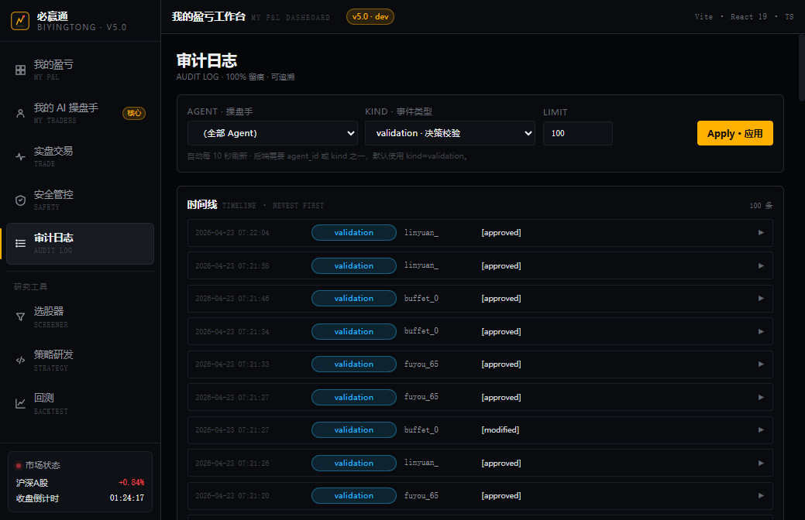

# 必赢通

基于通达信的 A 股量化终端。一侧挂着 `tqcenter` SDK 拉实时行情、下单；另一侧跑一套 LLM Agent 做策略决策，走 vnpy 回测引擎复盘。

目前处于可用原型阶段：6 个内置投资人格、10 款主流大模型、双模式回测、两层风控都已经串通，542 个测试稳定通过。实盘链路（LiveTrading）还没放出来 —— 涉及真金白银，等独立审批。


*我的 AI 操盘手 —— 10 个 agent 并存，左列是迷你净值曲线，右侧是单个 agent 的 persona × model × rules 详情。*

---

## 跑起来

```bash
pip install -r requirements.txt
python app.py
```

浏览器打开 `http://127.0.0.1:5000`。

看行情不需要登录通达信；下单需要本机装好 TDX 客户端、SDK 在 `C:\new_tdx_mock\PYPlugins\sys`，并在客户端里按 F12 登录委托账户。

第一次跑回测前要先灌一遍历史数据：

```bash
python scripts/setup/load_kline.py
python scripts/setup/load_index.py
python scripts/setup/load_financial.py
python scripts/setup/refresh_stock_status.py
```

要用 LLM 跑 Agent 回测，把对应的 key 放进环境变量。只认环境变量，HTTP 接口不接受 key：

```bash
ANTHROPIC_AUTH_TOKEN=...            # Anthropic 或兼容网关（智谱 GLM / Kimi）
ANTHROPIC_BASE_URL=...              # 网关可选
OPENROUTER_API_KEY=sk-or-...
OPENAI_API_KEY=sk-...
```

没 key 也能跑，策略里挂 `mock` 模型，走确定性桩数据。

新版前端是 Vite + React 19 + TypeScript，在 `frontend/`：

```bash
cd frontend
npm install
npm run dev         # 本地开发
npm run build       # 生产构建
npm run tauri:dev   # 桌面壳（需要 Rust 工具链）
```

旧的 CDN React 原型还留在 `static/`，`app.py` 默认托管它，作为不装 Node 也能看到界面的后备。两边 UI 并行存在，但已完工的页面都在 `frontend/`。

---

## 架构

```
浏览器 / Tauri 桌面壳
     │
     │ REST + SSE             WebSocket
     ▼                            ▼
┌──────────────────────────────────────────────┐
│              Flask (app.py)                   │
│                                               │
│   REST /api/*       BacktestRunner            │
│   SSE jobs/stream      ├─ Agent 模式          │
│   Socket.IO 行情       └─ Rule 模式           │
│                                               │
│   RedLine Engine   Validation Engine          │
└────┬─────────────────┬─────────────────┬─────┘
     │                 │                 │
     ▼                 ▼                 ▼
 LLM 适配层      tdx_service          SQLite × 3
 Claude/OpenAI  (tqcenter SDK)    vnpy_data / financial /
 /Gemini/Mock                     agent_state(WAL)
```

三个 SQLite 库分着放是故意的：

- `vnpy_data.db` — 历史 K 线，vnpy 自己管，读多写少。
- `financial_cache.db` — PE/PB/ROE 快照，月度刷新。
- `agent_state.db` — agent、prompt 版本、回测结果、审计日志，开了 WAL，允许多进程并发写。

---

## Agent 这一层怎么组织

一个 Agent 拆成四个可独立替换的维度：

```
Agent = Persona × Model × RulesOverride × (Capital, State)
          |         |           |
      投资哲学   具体模型     可加严的规则
      + 股票池   Claude /
      + 调度     GPT / GLM...
      + prompt
```

同一个 persona 可以跑在不同模型上做对比 —— "让 Claude 装林园" vs "让 DeepSeek 装林园"，看谁更像。

内置 6 个 persona，`personas/` 下每个一个文件，格式统一（`id/name/system_prompt/default_pool/default_schedule/default_rules/allowed_tools`）：

- **林园**：价值投资，白酒医药消费 15 只股票池，weekly 调仓，看 ROE>15%、毛利>30%。
- **傅游**：趋势动量，daily，顺势加仓、破位止损。
- **巴菲特**：护城河 + 安全边际，monthly。
- **索罗斯**：反身性宏观，daily，捕捉趋势转折。
- **量化中性**：多因子中性，daily。
- **日内 T0**：5 分钟级波段，调度是 `intraday_5m` —— 不过数据路径暂时只到日线，这个 persona 现在只有人格没有数据。

模型注册表在 `storage/sqlite_models.py`，出厂灌了 10 个条目，都是 2026-04 当下真实可调用的：Claude Opus 4.7 (1M) / Sonnet 4.6 / Haiku 4.5、GPT-5、GPT-4o、DeepSeek V3、Gemini 2.0 Pro、Hunyuan（走 OpenRouter）、GLM-5-turbo（走智谱 Anthropic 兼容网关）、Mock。

LLM 层本身是 vendor-neutral 的 —— `llm/base.py` 定义了统一的 `ToolSpec` 和消息格式，每家适配器（`claude.py` / `openai_adapter.py` / `gemini.py` / `mock.py`）负责翻译到自己的协议。Anthropic 的 `tools`、OpenAI 的 `function_calling`、Gemini 的 `functionDeclarations` 在业务代码里看起来是同一个东西。

### 工具集

LLM 通过严格 JSON 的 tool_use 循环跟系统交互，不走 XML/正则解析。`tools/` 下八个可调用工具：

| 工具 | 用途 |
|---|---|
| `place_decision` | 终态工具，下发买/卖/持有决策；整个 tool_use 循环的出口 |
| `get_kline`、`get_snapshot`、`get_index` | 行情、快照、指数 |
| `get_financials` | PE / PB / ROE / 毛利 / 增速 |
| `get_technical` | MA / MACD / RSI / BOLL |
| `get_portfolio` | 当前持仓 + 可用资金 |
| `get_news` | 新闻占位，后续接雪球/东财 |

Persona 在 `allowed_tools` 里白名单选可见工具。林园能看财报但看不到分时；日内 T0 反过来。

### prompt 版本化

每次改 `system_prompt` 自动 bump 一个版本写进 `agent_prompt_versions`，每个回测记录关联确切的 prompt 版本号。可以回滚到任一历史版本，但 diff UI 还只能并排列两个文本，没做高亮 diff。

---

## 回测

Agent 模式和 Rule 模式共用同一套 Book、撮合、T+1、佣金、Rating。区别只在"谁做决策"：Agent 模式每到 rebalance 日调一次 LLM；Rule 模式跑 `backtest/strategies/` 下的状态机（目前内置 MA 金叉、RSI 突破、MACD 与零轴交叉）。


*Rule 模式：均线金叉死叉，跨截止区分区指标里污染区 123 天、Sharpe -0.53 —— 这套参数在训练数据里都跑不过基线。*

每次回测无论怎么跑都自动并行 3 个基线对照：

- 沪深 300 买入持有
- 股票池等权持有
- 单票买入持有（参照系）

结果页 4 条曲线叠在一起看才有意义 —— 一个只跑赢自己的 agent 不说明什么。

### 知识泄漏防御

LLM 训练数据里可能已经"记住了" 2024 年茅台的走势，这会让历史回测虚高。处理办法：

1. 强制要求回测窗口横跨模型的 `training_cutoff`。
2. 结果按日期分两段统计 —— cutoff 之前叫 pollution zone，之后叫 clean zone。分别给 Sharpe、收益、回撤。
3. 两段差异大过阈值就在结果页标红。
4. system prompt 末尾自动追加一句"今天是 2026-04-24，你的训练截止于 2025-01"，逼模型装不知情（有没有用是另一回事，但至少不放水）。

这四件事合在一起也不能根除泄漏，只能让它可观察。

### 实时可观察性

回测是异步任务，前端订阅 SSE 流。事件分 7 类（spec §15.6）：

```
phase          data_loading / running / done
progress       每日步进，带当天日期
tool_call      某个 agent 调了 get_financials(600519)
decision       某个 agent 下了 place_decision
blocked        某个决策被 RedLine 拦了
baseline_done  基线跑完
done           终态
```

`frontend/src/components/LiveEventLog.tsx` 订阅后逐条渲染，回测进行中能看到 agent 实时在干什么，不用等 300 秒后才看结果。


*Agent 模式：林园风格 + Hunyuan，运行 51 秒，右下角实时事件流逐条进来。*

### 评级

单次回测完了有两个独立的分数。

Strategy Rating（`rating/strategy_rating.py`）是 5 个子分数加权，得 A+ / A / B / C —— 收益率、风险控制（Sharpe + MaxDD）、稳定性（月度胜率）、执行质量（trade 频率 vs rebalance 节奏）、能力圈匹配（是否偏离持仓风格）。

Agent Health（`agents/rating.py`）是跨 session 累积的，按公式：

```
health = max(0, 100 - violations_7d*3 - backtest_deviation_pts*2 - parse_failures_7d*1)
```

违规、偏离基线、tool_use 解析失败三件事都会扣分。90+ 是 A+，80-89 是 A，60-79 是 B，60 以下是 C。这套分数直接决定 Dashboard 上"谁该信谁该慎"。


*Agent 一条线对照三个基线（buy_and_hold / csi300 / equal_weight），右下角是 5 个子分数。这次林园只跑了 11 个交易日没出手，所以收益力 0、稳定性 100、综合 D。*

每条交易、每次 LLM 决策都能往下钻：


*点开任意一天的决策日志，能看到 LLM 当时的中文 reasoning 和 7 项质量门检查（图中 Min Sharpe / Min Trade Count / Min Win Rate 三项不通过）。*

---

## 风控两层

```
┌─────────────────────────────────────────┐
│ 全局 RedLine（硬上限，所有 agent 必须遵守）│
│   单票 ≤ 30%   持仓 ≤ 15   日损 -3% 清仓  │
│   禁 ST                                   │
└─────────────────────────────────────────┘
                 ▲  必须 ≥
                 │
┌─────────────────────────────────────────┐
│ Per-Agent Rules Override（只能加严）      │
│   林园：单票 ≤ 20%   持仓 ≤ 8             │
│   量化：日损 -2%                          │
└─────────────────────────────────────────┘
```

RedLine 是服务端单例，每个来自任何 agent 的订单都过一遍。Per-Agent 规则可以比 RedLine 严，不能比它松 —— UI 层会 clamp。具体 handler 在 `validation/handlers/` 下：`position_max_pct`、`max_holdings`、`ban_st`、`daily_loss_limit_pct`。被拦的决策写进 `audit_log`，同时作为 SSE 的 `blocked` 事件推给前端。


*三层防护（L1 全局红线 / L2 Agent 覆写 / L3 决策前校验）+ 全局红线配置。HARD 规则不可跨越，SOFT 仅警告。*

`/audit` 页是这些审计记录的时间线视图，10 秒自动刷新：


*按 agent / 事件类型过滤，每条决策都能展开看到原始 LLM 输出和验证结果。*

---

## 目录结构

```
app.py                  Flask 入口，REST + WebSocket
tdx_service.py          tqcenter SDK 的线程安全单例封装
requirements.txt

api/                    REST 蓝图，按领域拆
agents/                 Agent 运行时（tool_use 循环、prompt 构造、context）
llm/                    vendor-neutral LLM 层 + factory
personas/               6 个内置人格定义
tools/                  8 个 LLM 可调工具
backtest/
  runner.py             Agent 模式
  rule_runner.py        Rule 模式
  multi_agent_runner.py 并行多 agent
  book.py               撮合 + T+1 + 佣金
  strategies/           MA / RSI / MACD
  baselines/            HS300 / 等权 / B&H
  jobs.py               异步任务队列 + SSE 事件
validation/             两层风控
rating/                 Strategy Rating 计算
storage/                SQLite Protocol + 实现
data_schema/            TypedDict / dataclass
frontend/               Vite + React 19 + TS + Tauri 桌面壳
static/                 旧版 CDN React 原型（仍可用）
scripts/
  setup/                首次灌数据
  smoke/                真 LLM 端到端冒烟
tests/                  94 个测试文件
docs/
  superpowers/specs/    设计规范
  superpowers/plans/    P0-P3E 实施 plan
  references/           tqcenter 官方文档
```

---

## 当前进度

按 `docs/superpowers/plans/2026-04-23-status-and-roadmap.md` 口径，从 P0 到 P3E 全部结束：

- **P0-P1**：TDX 数据通路、SQLite 三库分离、LLM 适配层、prompt cache 抽象。
- **P2a-P2f**：persona × model × rules 四维、两层风控、Agent 回测引擎、3 基线并行、5 子分数 Rating、异步提速、prompt 版本化、zone 分区。
- **P3A**：回测可观察性 —— NAV / Trades / Thinking 三个端点，前端加 4 曲线图、交易流水、Thinking Drawer、Quality Gate 面板。
- **P3B**：Agent / Persona CRUD + prompt 回滚。
- **P3C**：Rule 模式回测，BacktestLab 双 tab 切换。
- **P3D**：SSE 7 事件细粒度。
- **P3E**：in-prompt disclaimer、全局 backtest 列表端点、TopBar RedLineBar widget。

还没做的：

- **LiveTrading 全链（P3F）** —— subprocess 隔离的 agent 进程、消息总线、用户逐单审批、崩溃恢复、实盘链路。卡在真金白银审批。
- **Intraday 1m/5m** —— TDX 数据路径待打通。
- **事件驱动调度** —— 新闻触发、价格异常触发、agent 间协作。Phase 2+。
- **Strategy Marketplace** —— 社区订阅。Phase 2+。
- **Token / ¥ 成本追踪** —— 明确不做，P1 时已决定。

---

## 测试

```bash
pytest -q            # 542 通过，约 3 分钟
pytest -n auto       # xdist 并行

cd frontend
npm run build        # tsc -b 严格模式 + Vite build
npm run lint
```

覆盖面：book、commission、T+1 cutoff、三种 rule 策略、三个 baseline、Agent runner、prompt 构造、SSE 事件、验证引擎、prompt 版本存储、API 蓝图。

`scripts/smoke/` 下有用真 LLM 跑通一次完整 tool_use 循环的脚本。想快速验证 LLM 侧没问题用 Hunyuan（OpenRouter）—— 同样的 prompt GLM-5 比它慢 10 倍左右，且指令遵循较差。

---

## 一些约定

- **颜色**：红涨绿跌，A 股惯例。前端 tokens 用 oklch 色空间。
- **初始资金**：默认 100 万，可选 10 万 / 50 万 / 100 万 / 500 万。不做 1 万级别 —— 手续费占比会让回测失真。
- **图表库**：`lightweight-charts`。React 19 StrictMode 下这个库命令式 API 必须用单个依赖 `[data]` 的 useEffect，不要拆成 mount-once + data-sync 两段（会导致 disposed chart 上调 update）。
- **不提交的文件**：`data/`、`*.db` 系列、`*.png`（包括各种 screenshot）、`.playwright-mcp/`、`frontend/node_modules`、`frontend/dist`、`frontend/src-tauri/target`。

---

仓库内没声明 License。自用 / 分发前跟作者确认。
